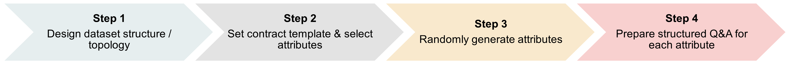
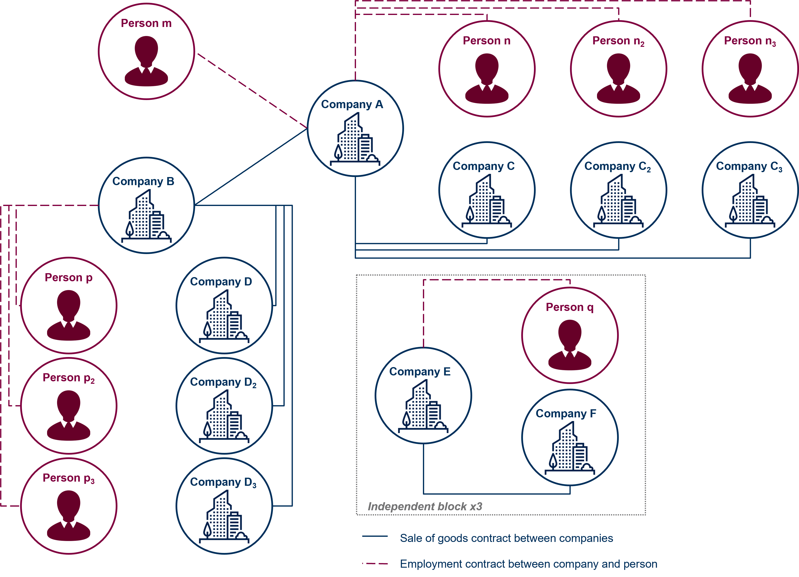
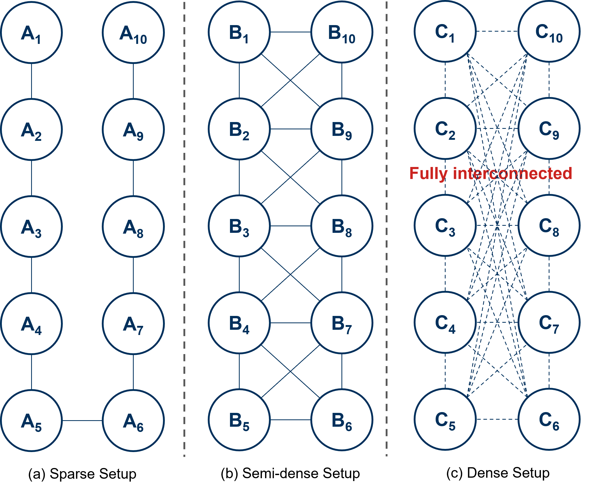

# PISTOL: Dataset Compilation Pipeline for Structural Unlearning of LLMs

### Quick Links

- [arXiv paper](https://arxiv.org/abs/2406.16810)
- [HuggingFace Dataset](https://huggingface.co/datasets/xinchiqiu/PISTOL)

### Abstract

Recently, machine unlearning, which seeks to erase specific data stored in the pre-trained or fine-tuned models, has emerged as a crucial protective measure for LLMs. However, unlearning approaches for LLMs that have been considered thus far have focused on the removal of independent data points and have not taken into account that the stored facts are logically connected to one another and form an implicit knowledge graph. To facilitate the development of **structural** unlearning methods, which are essential for the practical application of unlearning, we propose PISTOL, a pipeline for compiling multi-scenario datasets for benchmarking structural LLM unlearning. Additionally, leveraging sample datasets synthesized using PISTOL, we conducted benchmarks with four distinct unlearning methods on both Llama2-7B and Mistral-7B models. This analysis helps to illustrate the prevailing challenges in effectively and robustly removing highly inter-connected data, batched data, or data skewed towards a specific domain. It also highlights the choice of pre-trained model can impact unlearning performance. This work not only advances our understandings on the limitation of current LLMs unlearning methods and proposes future research directions, but also provides a replicable framework for ongoing exploration and validation in the field.

### Data Compilation Pipeline

The pipeline for compiling datasets in a controlled manner is illustrated in Figure shown below: 

Specifically for our sample dataset used in the paper:
- The first step is to craft the overall knowledge-graph structure, taking into account the structural variation of unlearning and the specific problem to investigate. 

- We set the contract template, each with 20 attributes to be filled in. We focused on two ubiquitous types of contracts, sales of goods and employment contracts, owing to their more standardized structure in contrast to other highly customized agreements like corporate sale and purchase agreements or share subscription agreements. 

- We generate attributes in a random manner, taking into account the dataset size. In our sample datasets, we randomly generate 6 letters and a suffix for a company name (e.g. Empblq LLC), 4 letters for the first name and the surname of a person (e.g. Jkeq Cyfz), 3 numbers, 6 letters and a street type for an address (e.g. 442 Rcvvyy Boulevard). Other attributes such as the signing date, contractual terms, and governing jurisdiction are also randomly generated. 

- Finally, we prepare a QA pair for each attribute. 

The graph illustraion for Sample datasest 1 and 2 can be found below:




### **Applicability**

The dataset is in QA format based on structural graphs, making it ideal for use with popular chat models such as Llama2 or Mistral. However, it also works for any other large language model. The corresponding code base is written for the Llama2-7B chat and Mistral-7B, but can be easily adapted to other models.

### Create Environment

```bash
conda env create -f pistol.yml
conda activate pistol
```

### Data Generation Pipeline

As explained and discussed in our paper, we are providing a dataset compilation pipeline for structural unlearning dataset. This work intends to address the limitations of previous datasets, especially the lack of a structural dataset that reflects knowledge-graph-based data topology. By developing an easy-to-use and versatile pipeline, researchers can easily design and synthesize their own datasets for investigating the role that data structure or topology plays in the process of unlearning. While we leave to future research the creation of a specific large and complex dataset, we intend to advance the understanding of LLM unlearning methods by answering the questions above. We provide both `sample_data_1` and `sample_data_2` used in the paper in this repo under `data`, and leave other specific structural dataset for future research. We also provide the data generation pipeline under `data/contract_generation` as reference. 

### Finetune

The code currently supports `Llama2-7b chat` or `Mistral-7b-chat` models, or any other model. You can easily replace the model name in the `config/yaml` file. We fine-tuned `Llama2-7b chat` for 20 epochs using a maximum learning rate of `2e-5`, and the `Mistral-7b-chat` model for the same duration at `1e-5`. Both finetuning and forgetting share the same yaml file. Finetuning can be done as follows:

```bash
python finetune.py
```

### Unlearn

We selected four of those methods -- Gradient Ascent (GA), Gradient Difference (GD), KL-divergence and DPO -- that represent the current mainstream for the purpose of benchmarking. The unlearning method can be easily switched in the `config.ymal` file.

```bash
python forget.py
```

### Cite Our Work

If you find our codebase and dataset beneficial, please kindly cite our work. If you have any thoughts or questions on the project, please don’t hesitate to reach to us! 😊

```
@misc{pistol2024,
      title={PISTOL: Dataset Compilation Pipeline for Structural Unlearning of LLMs},
      author={Xinchi Qiu, William F. Shen, Yihong Chen, Nicola Cancedda, Pontus Stenetorp, Nicholas D. Lane},
      year={2024},
      archivePrefix={arXiv},
      primaryClass={cs.LG}
}
```

